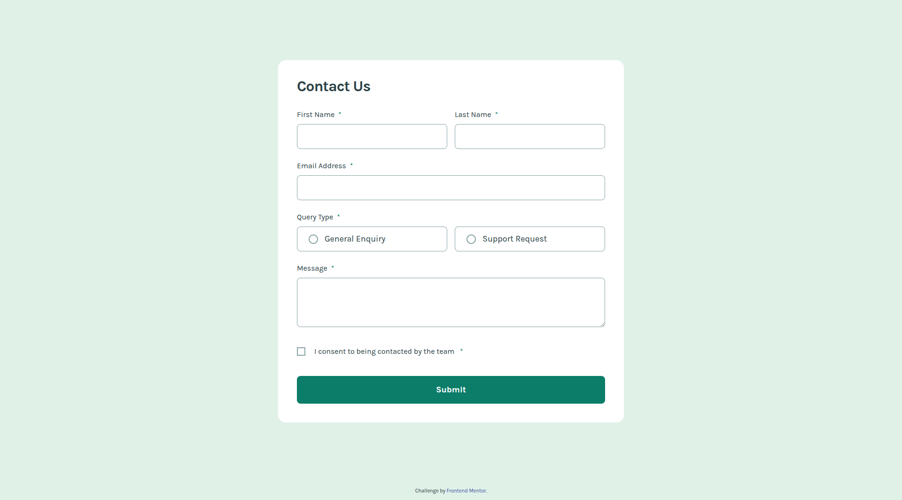

# Frontend Mentor - Contact form solution

This is a solution to the [Contact form challenge on Frontend Mentor](https://www.frontendmentor.io/challenges/contact-form--G-hYlqKJj). Frontend Mentor challenges help you improve your coding skills by building realistic projects.

## Overview

A responsive Contact form challenge, where users can:

- Complete the form and see a success toast message upon successful submission
- Receive form validation messages if:
  - A required field has been missed
  - The email address is not formatted correctly
- Have inputs, error messages, and the success message announced on their screen reader
- View the optimal layout for the interface depending on their device's screen size
- See hover and focus states for all interactive elements on the page

### Screenshot

### Links

### Built with

- Semantic HTML5
- SCSS (Sass) — compiled to CSS
- Flexbox
- Vanilla JavaScript (DOM manipulation)

## Acknowledgments

- Challenge by [Frontend Mentor](https://www.frontendmentor.io).
